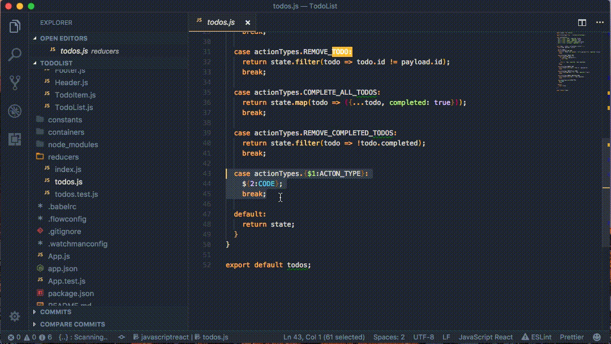

# Snippetier

Create code snippets from the editor selection.

## Features

Visual Studio Code command to create user code snippets from the editor selection without need to manually edit json files.

## Release Notes

### 0.1.0

Initial release